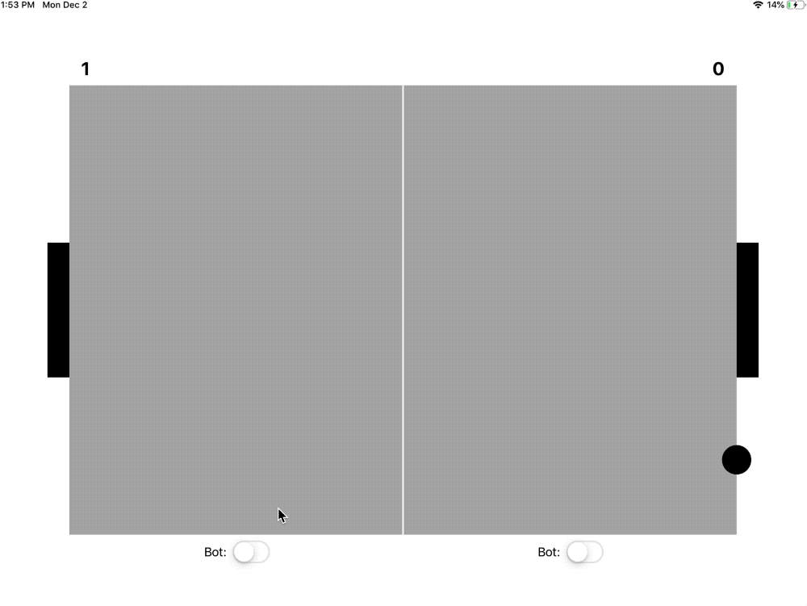

# Pong
Pong iOS game 

You can play together or against a bot. You can also enable two bots playing against each other if you will. 

The game was designed to easily add new implementations of bots. You can do this by subclassing from `Player` which exposes the `ball` reactive property. The `Ball` is characterized by its `location` and `direction`. Based on these two properties, you can then move a racket by setting the `y` reactive property of the player.

All the logic is reactive and has a `CADisplayLink` events at its source. 

